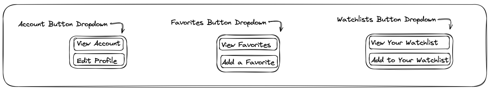
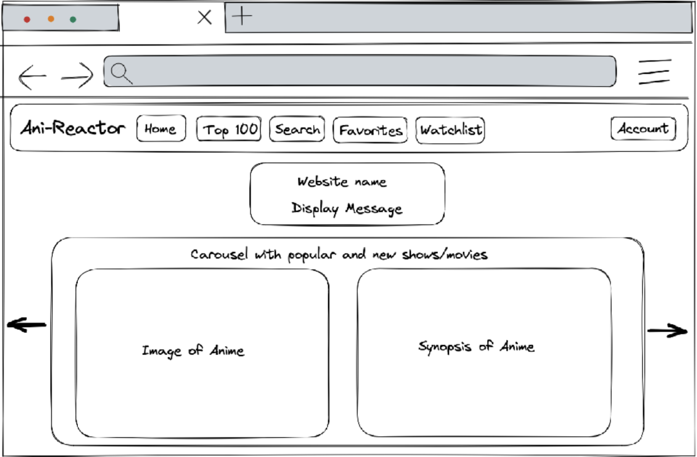
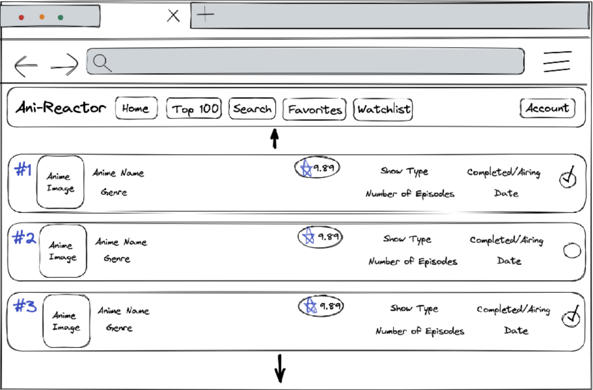
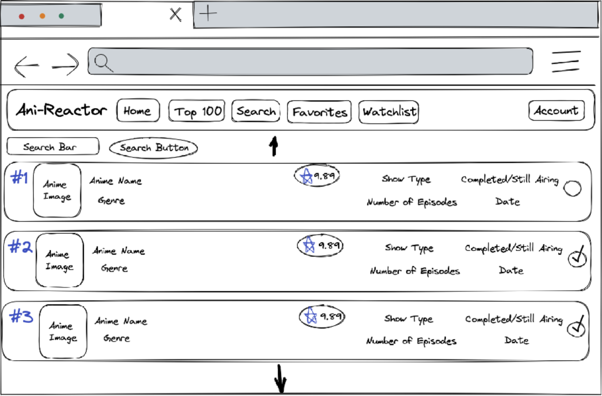
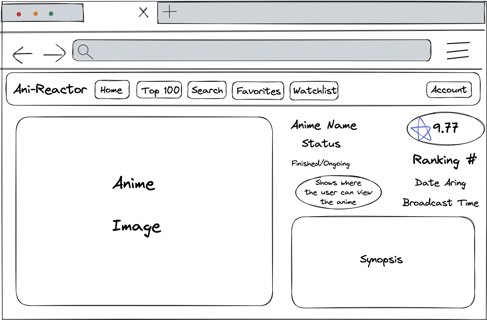
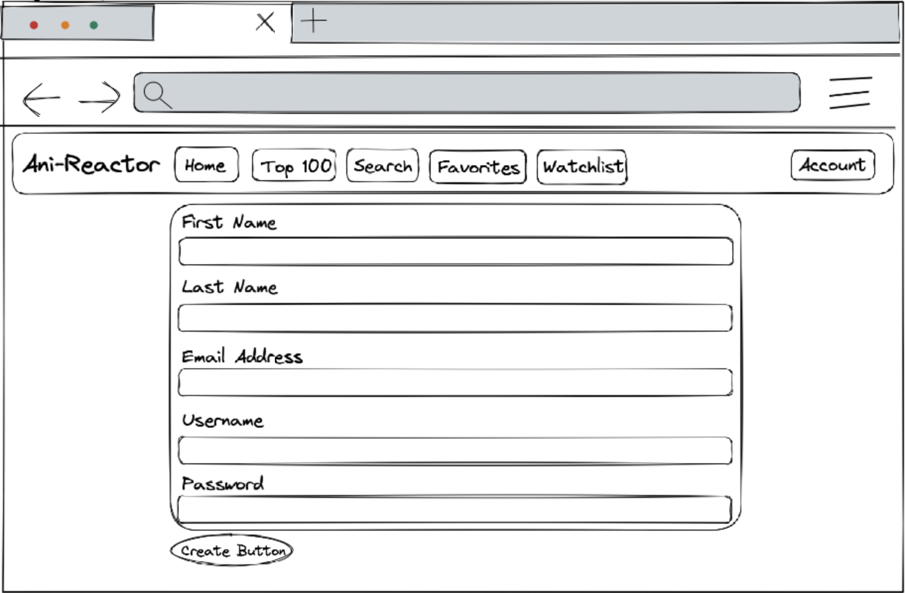
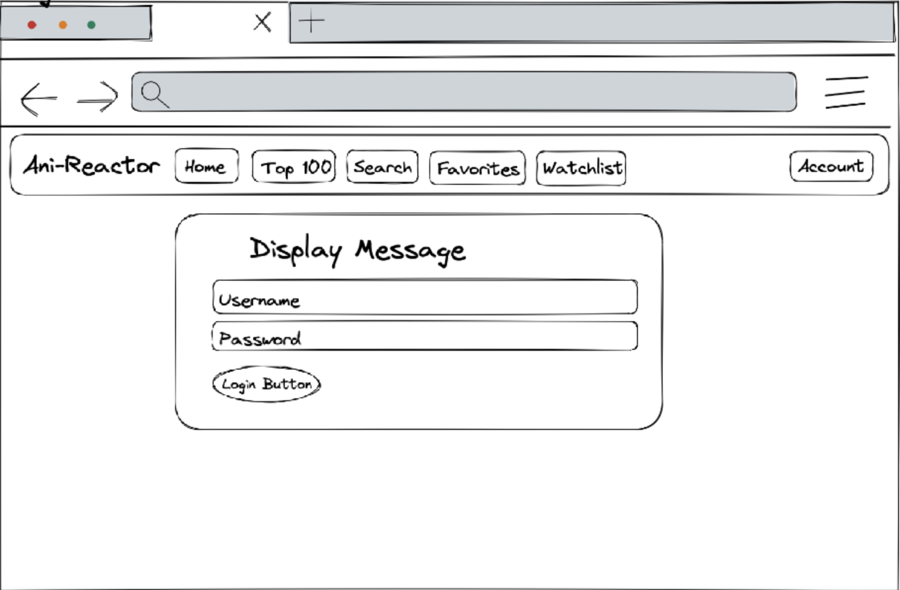
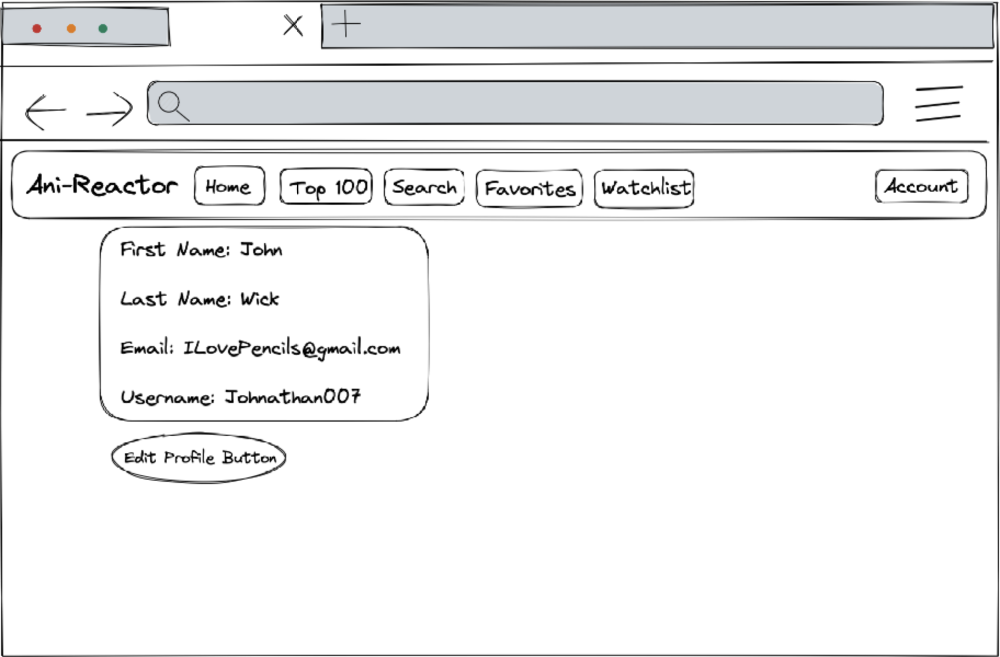
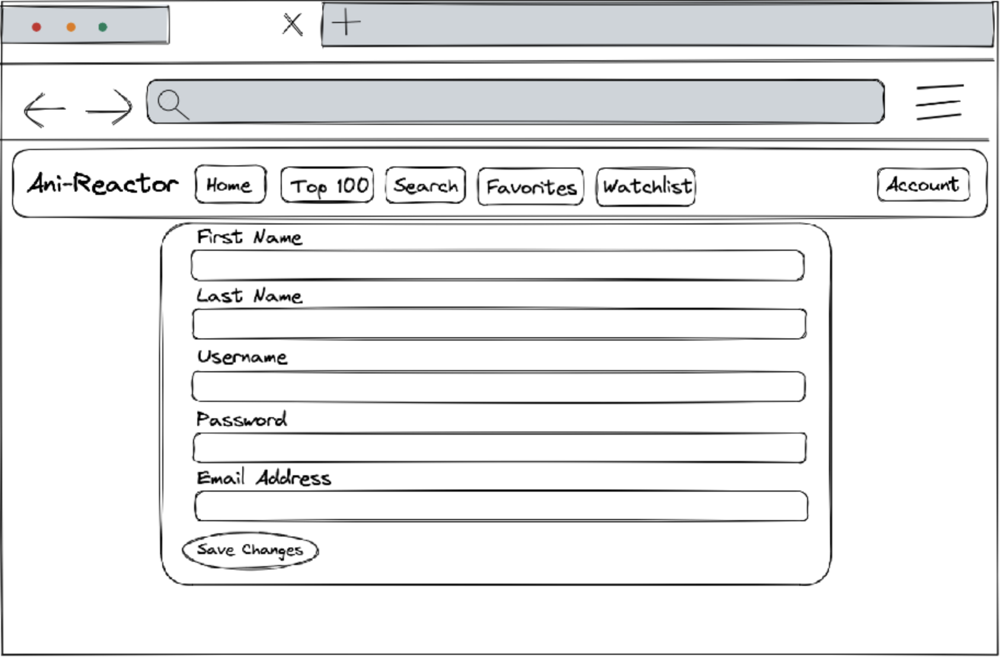

# Interface Gráfica do Usuário para Clientes

## Menu Dropdown

## Página Principal
Quando os visitantes acessam nossa página, eles verão a página principal com um carrossel de animes populares!

## Top 100
Uma vez que estejam cadastrados, poderão navegar pelos animes mais bem classificados por outros usuários.

## Lista de Pesquisa
Se alguém souber o que deseja assistir ou se quiser explorar o site, poderá usar a função de pesquisa.

## Visualização de Detalhes do Anime
Quando um visitante clica em um anime, serão exibidos detalhes para ajudá-lo a entender do que se trata o anime e possivelmente despertar seu interesse nesse anime.

## Formulário de Inscrição
O formulário de inscrição exigirá o primeiro nome, sobrenome, endereço de e-mail, nome de usuário e senha do usuário.

## Login
Quando um usuário retorna ao site, ele poderá fazer login em sua conta para acessar áreas exclusivas para membros, como uma página personalizada de favoritos e lista de assistência.

## Visualização de Detalhes da Conta
O usuário pode ver as informações de sua conta clicando no botão de visualização da conta. Isso apresentará suas informações atuais.

## Formulário de Edição de Perfil
Se por algum motivo o usuário quiser alterar suas informações, ele pode proceder ao formulário de edição de perfil para mudar seu nome, sobrenome, nome de usuário, senha ou endereço de e-mail.

